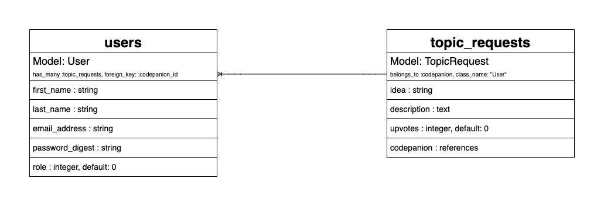

# JavaScript Project Planning

## Application Overview

**Title: Code Talk Requests**

My application will let learning programmers make study group topic requests.

## User Stories

### `Codepanion`

* A `Codepanion` can view all `TopicRequests`
* A `Codepanion` can upvote a `TopicRequest`
* A `Codepanion` can create a `TopicRequest`
  * A `Codepanion` can edit and/or delete their own `TopicRequests`

## Model Attributes & Migrations




```ruby
class CreateUsers < ActiveRecord::Migration[6.0]
  def change
    create_table :users do |t|
      t.string  :first_name
      t.string  :last_name
      t.string  :email_address
      t.string  :password_digest
      
      t.timestamps null: false
    end
  end
end
```





```ruby
class CreateRequests < ActiveRecord::Migration[6.0]
  def change
    create_table :topic_requests do |t|
      t.string     :idea
      t.text       :description
      t.integer    :upvotes
      t.references :codepanion
      
      t.timestamps null: false
    end
  end
end
```




Add the `User` enum `role` column to the database only _after_ its values are coded into the `User` model:

```bash
rails g migration AddRoleToUsers
```

Will generate:


```ruby
class AddRoleToUsers < ActiveRecord::Migration[6.0]
  def change
    add_column :users, :role, :integer, default: 0
  end
end
```


## Model Associations

#### `User` — `TopicRequest`

The associations for when a `User` creates a new `TopicRequest`




```ruby
class User < ApplicationRecord
  has_many :topic_requests, foreign_key: :codepanion_id
  
  enum role: {codepanion: 0, super_admin: 1}
end
```





```ruby
class TopicRequest < ApplicationRecord
  belongs_to :codepanion, class_name: "User"
end
```




## Domain Model



## JS Modularization

* Find a place to house the URLs and options for the `fetch()` methods
* Separate the HTML code patterns from the rest of the app
* Refactor code after it's written out

## Wireframing & View Pages

Model after Flatiron's Learn.co platform

### Nav Bar

The app's navigation will contain:

* **Logo**: hyperlinked to the home page
* **Home**: hyperlinked to the home page
* **Create a Topic Request**: triggers a modal pop-up containing a new topic request form
* **Log Out**: logs the user out of the app

### Home Page

The home page consists of two sections:

#### Section 1: User Dashboard

* Displays a list of the logged-in codepanion's topic requests with their associated upvotes

#### Section 2: All Topic Requests

* Displays a list of all other users' topic requests with their associated upvotes

### Create a Topic Request Form

* Display this form inside a pop-up modal
* Trigger an alert when the user clicks the button to create a new topic request
  * Have it say something like, "Remember to check existing topic requests to make sure yours is not a duplicate!"

### Edit a Topic Request Form

* Allows the user to edit their own topic request
* Displayed only on the topic requests located in the 'User Dashboard'

### Login

* Copy login page styling directly from the Learn.co platform

### Logout

* Copy logout flow directly from the Learn.co platform
  * A selection on the dropdown menu of the user avatar
* Redirect the user to the login page and use a toast to alert the user that they have been logged out

