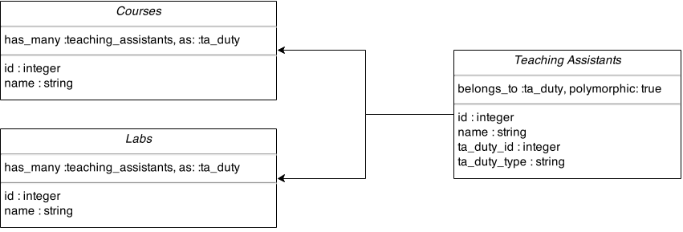

# Active Record Associations

## Polymorphic Associations

Polymorphic associations use a big word to describe a relatively straightforward concept: What if you have a single model that can belong to a bunch of different types of models? The official [Ruby on Rails Guide](https://guides.rubyonrails.org/association_basics.html#polymorphic-associations) states "with polymorphic associations, a model can belong to more than one other model, on a single association."

### Use Cases

While writing some Rails applications, you will run into situations when you have model associations that seem to be similar. For example, let's assume you have `Course` and `Lab` models in your application. Now each `Course` and `Lab` need `TeachingAssistants`, so you need to associate `Course` and `Lab` to their corresponding `TeachingAssistants`. If you use the `has_many`/`belongs_to` association here, you will have two similar models for the `TeachingAssistants` of `Course` and the `TeachingAssistants` of `Lab:`




```ruby
class Course < ApplicationRecord
  has_many :course_teaching_assistants
end
```





```ruby
class CourseTeachingAssistant < ApplicationRecord
  belongs_to :course
end
```





```ruby
class Lab < ApplicationRecord
  has_many :lab_teaching_assistants
end
```





```ruby
class LabTeachingAssistant < ApplicationRecord
  belongs_to :lab
end
```




Instead of having two different models, you can have a single `TeachingAssistant` model and associate it with the `Course` and `Lab` models using a polymorphic association. Here's how:

First, create a `TeachingAssistant` model:

```bash
rails g model TeachingAssistant name ta_duty_id:bigint ta_duty_type
```

Will generate:


```ruby
class CreateTeachingAssistants < ActiveRecord::Migration[6.0]
  def change
    create_table :teaching_assistants do |t|
      t.string :name
      t.bigint :ta_duty_id
      t.string :ta_duty_type
      
      t.timestamps
    end
    
    add_index :teaching_assistants, [:ta_duty_type, :ta_duty_id]
  end
end
```


This migration can be simplified using the `t.references` form:

```bash
rails g model TeachingAssistant name ta_duty:references
```

Will generate:


```ruby
class CreateTeachingAssistants < ActiveRecord::Migration[6.0]
  def change
    create_table :teaching_assistants do |t|
      t.string :name
      t.references :ta_duty, polymorphic: true
      
      t.timestamps
    end
  end
end
```


Now that our model is generated, we run the migration with `rake db:migrate`. Let's set up the `TeachingAssistant` polymorphic association model:




```ruby
class TeachingAssistant < ApplicationRecord
  belongs_to :ta_duty, polymorphic: true
end
```




By making `TeachingAssistant` `belong_to` `ta_duty` instead of any other model, we have declared a polymorphic association. Note that we do not have any `ta_duty` model or class in our application. `ta_duty` has the sole purpose of taking care of the polymorphic association. Now let's look at the other side of this equation:




```ruby
class Course < ApplicationRecord
  has_many :teaching_assistants, as: :ta_duty
end
```





```ruby
class Lab < ApplicationRecord
  has_many :teaching_assistants, as: :ta_duty
end
```




The code above says the `Course` `has_many` `TeachingAssistants` and `Lab` `has_many` `TeachingAssistants` via the polymorphic association `ta_duty`. In the below pictorial representation, we can see how `TeachingAssistant` is associated with the two models `Course` and `Lab` in a single association via `ta_duty`.




**BEST PRACTICES:** Although the above example doesn't demonstrate this, a Rails convention is to come up with an abstract term for what type of action you're doing and use that to name the association. You'll see the `*able` convention used quite a lot. \(i.e. `commentable`, `buyable`, `likable`, etc.\)


### But How Does It All Work?

We could store a different foreign key for each related model, but that would make a new column for each foreign key stored in the `belongs_to` association model's table — and that could be _**100's!**_ In order not to load up our table with unnecessary data, let's stick with only one foreign key column.

Instead, for each related model we'll store a foreign key **and** a reference to which **type** of model it is. Now we have a foreign key that holds the `id` of our association and a `type` to direct Rails to the appropriate table to retrieve our object. **Rails does this for you as long as it knows you're working with a polymorphic association.**

### Single Table Inheritance \(STI\) vs. Polymorphic Association

STI can be a good alternative to polymorphic associations, depending upon the situation. In STI, we inherit similar models form a base model which inherits from `ActiveRecord::Base`. STI provides us with more flexibility than polymorphic associations but we have to create separate classes to implement the associations. They also add a lot more code and can be more difficult to implement compared to polymorphic associations.



### Limitations

`inverse_of:` does not work with polymorphic associations.

### Resources







## Options in Active Record Associations

### Foreign Keys & Class Names

When you create an association, Rails makes two major assumptions:

1. The class of the model your association points to is based directly off of the name of the association.
2. The foreign key in any `belongs_to` relationship will be called `yourassociationname_id`.

Whenever we deviate from these defaults, we just need to let Rails know what kind of class to look for and which foreign key to use.

A simple example for this would be a User who can create many Posts for a blog:




```ruby
class User < ApplicationRecord
  has_many :posts
end
```





```ruby
class Post < ApplicationRecord
  belongs_to :user
end
```






```ruby
User.first.posts
# Returns all posts written by the first user

Post.first.user
# Returns the author user of the first post
```



With the above Active Record methods, Rails knows to look for a foreign key called `user_id` in the Posts table. All is well in the world when your association names correspond directly to the names of your models and tables.

But what if you want to have two types of users that the post belongs to — the author and the editor? In this case, you'll need two separate foreign keys in your Posts table — `author_id` and `editor_id`. How do you tell Rails that each of these foreign keys actually point to a User \(so it knows to look in the Users table for them\)? Just specify the class your association should point to using the aptly-named `:class_name` option:




```ruby
class Post < ApplicationRecord
  belongs_to :author, class_name: "User"
  belongs_to :editor, class_name: "User"
end
```




Now Rails will automatically look for the foreign key named after the association — `author_id` or `editor_id` — in the Posts table.

If you called the association something which didn't correspond exactly to what you'd named the foreign key in your table, you need to tell Rails that as well. This should make sense if you think of this relationship from the side of the User. The User will have some posts for which they are an author and others for which they are an editor. You'll need to rename the association on the User's side as well to keep things crystal clear, for instance splitting up `authored_posts` from `edited_posts`.

But right now, Rails has no clue where to look and what to look for! By default, if you ask for `User.first.authored_posts`, Rails will look in the `authored_posts` table for a foreign key called `user_id` \(neither of which exist\). To get it pointing to the correct table and foreign key again, we need to specify the `:class_name` and `:foreign_key` respectively:




```ruby
class User < ApplicationRecord
  has_many :authored_posts, foreign_key: "author_id", class_name: "Post"
  has_many :edited_posts, foreign_key: "editor_id", class_name: "Post"
end
```




#### Summary

Assume that Rails is looking for the foreign key named after the association in the table also named after the association. If any of these are incorrect because of a creatively-named association or foreign key, you'll need to specify that in your models. This is quite common to make your associations more legible.


**NOTE:** What is referred to as "creatively naming" an association is also known as aliasing an association.


### Source

Now that it's clear you need to let Rails know when you've creatively named your associations or foreign keys, you should know that there's one additional step required if you're using a creatively-named `has_many :through` association. Recall that has-many-through associations are where you create a join table to act as a go-between for two models that have a many-to-many relationship.

Let's see what happens if we change the example above so a Post can have multiple Authors \(but still only one Editor\). We'll need to create a new table which we'll call `post_authorings`. `post_authorings` joins these two models together and contains columns for `authored_post_id` and `post_author_id`. We've named our foreign keys something more descriptive and helpful than just simply `post_id` and `user_id` but it will require us to inform Rails of the change.

These are our models:




```ruby
class User < ApplicationRecord
  has_many :post_authorings, foreign_key: :post_author_id
  has_many :authored_posts, through: :post_authorings
  has_many :edited_posts, foreign_key: :editor_id, class_name: "Post"
end
```





```ruby
class PostAuthoring < ApplicationRecord
  belongs_to :post_author, class_name: "User"
  belongs_to :authored_post, class_name: "Post"
end
```





```ruby
class Post < ApplicationRecord
  has_many :post_authorings, foreign_key: :authored_post_id
  has_many :authors, through: :post_authorings, source: :post_author
  belongs_to :editor, class_name: "User"
end
```




These are our migrations:




```ruby
class CreateUsers < ActiveRecord::Migration[6.0]
  def change
    create_table :users do |t|
      t.string :name
      
      t.timestamps
    end
  end
end
```





```ruby
class CreatePosts < ActiveRecord::Migration[6.0]
  def change
    create_table :posts do |t|
      t.references :authored_post
      t.references :post_author
      
      t.timestamps
    end
  end
end
```





```ruby
class CreatePosts < ActiveRecord::Migration[6.0]
  def change
    create_table :posts do |t|
      t.text       :content
      t.references :editor
      
      t.timestamps
    end
  end
end
```




The major thing to note here is that with has-many-through associations, Rails uses the _name of the association in the through table_ to determine which foreign key and table name to reach out to. If it's named anything irregular, you'll use the `:source` option to specify which association actually points where we'd like to go. You can think of `:source` as being just like `:class_name` but for the associations in the join table.


**NOTE:** The above example creatively names a majority of the associations. In reality, this isn't necessarily needed. Our example can be rewritten as follows:


These are our models simplified:




```ruby
class User < ApplicationRecord
  has_many :post_authors, foreign_key: :author_id
  has_many :authored_posts, through: :post_authors
  has_many :edited_posts, foreign_key: :editor_id, class_name: "Post"
end
```





```ruby
class PostAuthor < ApplicationRecord
  belongs_to :author, class_name: "User"
  belongs_to :authored_post, class_name: "Post"
end
```





```ruby
class Post < ApplicationRecord
  has_many :post_authors, foreign_key: :authored_post_id
  has_many :authors, through: :post_authors
  belongs_to :editor, class_name: "User"
end
```




These are our migrations simplified:




```ruby
class CreateUsers < ActiveRecord::Migration[6.0]
  def change
    create_table :users do |t|
      t.string :name
      
      t.timestamps
    end
  end
end
```





```ruby
class CreatePostAuthors < ActiveRecord::Migration[6.0]
  def change
    create_table :post_authors do |t|
      t.references :author
      t.references :authored_post
      
      t.timestamps
    end
  end
end
```





```ruby
class CreatePosts < ActiveRecord::Migration[6.0]
  def change
    create_table :posts do |t|
      t.text       :content
      t.references :editor
      
      t.timestamps
    end
  end
end
```




While learning these concepts, it can also be helpful to look at your Rails server output to see which joins are being done to build your SQL queries. That's a great window into what your associations are doing behind the scenes \(because in the end, it's all about figuring out the correct SQL query to run\).

### Resources



## Self Joins

Often times you have relationships between the same type of model, for instance users who can follow other users. In this case, you need to specify both associations in your User model but name them differently. You will need to specify in your `has_many` association what the name of the `foreign_key` will be:


```ruby
class Employee < ApplicationRecord
  has_many :subordinates, class_name: "Employee", foreign_key: :manager_id
  belongs_to :manager, class_name: "Employee"
end
```


### Resources



## Aliasing Associations  in Active Record

### Active Record Naming Conventions

| Model/Class | Table/Schema |
| :--- | :--- |
| Article | articles |
| LineItem | line\_items |
| Deer | deers |
| Mouse | mice |
| Person | people |

### Change the Table Name


```ruby
class Order < ApplicationRecord
  self.table_name = :purchases
end
```


### Change the Primary Key




```ruby
class User < ApplicationRecord
  self.primary_key = :user_key
  has_many :orders
end
```





```ruby
class Order < ApplicationRecord
  belongs_to :user, primary_key: :user_key
end
```




### Resources



## Aliasing Associations with Enums


## Preloading Rails Scopes


### Resources



