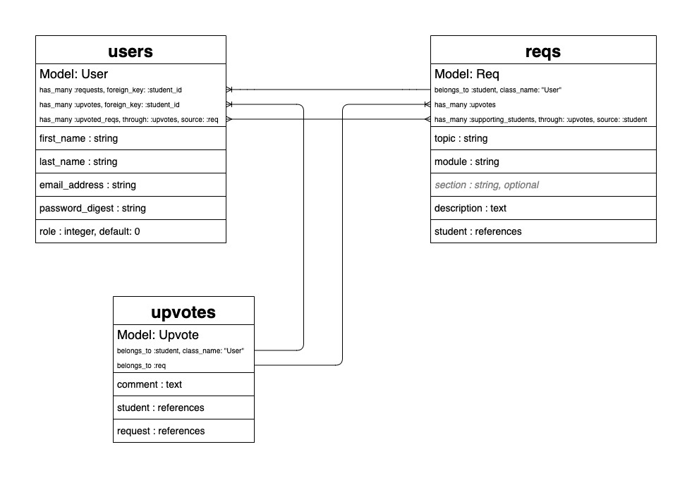

# v1

## Planning

My application will let Flatiron students in the online self-paced track make study group topic requests.

## User Stories

### `Student`

* A `Student` can view all `Reqs`
* A `Student` can add one `Upvote` on any `Req` as long as they don't own the `Req`
  * A `Student` can comment on a `Req` that they've `Upvoted`
* A `Student` can create a `Req`
  * A `Student` can edit and/or delete their own `Reqs` as long as there are no `Upvotes` against it


**Authorization:** This goes beyond the scope of the MVP. Focus on `Req` and `Upvote` models for now.


## Model Attributes & Migrations




```ruby
class CreateUsers < ActiveRecord::Migration[6.0]
  def change
    create_table :users do |t|
      t.string  :first_name
      t.string  :last_name
      t.string  :email_address
      t.string  :password_digest
      t.integer :role
      
      t.timestamps null: false
    end
  end
end
```





```ruby
class CreateUpvotes < ActiveRecord::Migration[6.0]
  def change
    create_table :upvotes do |t|
      t.text :comment
      t.references :student
      t.references :req
      
      t.timestamps null: false
    end
  end
end
```





```ruby
class CreateReqs < ActiveRecord::Migration[6.0]
  def change
    create_table :reqs do |t|
      t.string     :topic
      t.string     :module
      # t.string   :section
      t.text       :description
      t.references :student
      
      t.timestamps null: false
    end
  end
end
```




Add the `User` enum `role` column to the database only _after_ its values are coded into the `User` model:

```bash
rails g migration AddRoleToUsers
```

Will generate:


```ruby
class AddRoleToUsers < ActiveRecord::Migration[6.0]
  def change
    add_column :users, :role, :integer, default: 0
  end
end
```


## Model Associations

Two types:

#### `User` — `Req`

The associations for when a `User` creates a new `Req`

#### `User` — `Upvote` — `Req`

The associations for when a `User` creates an `Upvote` on an existing `Req`




```ruby
class User < ApplicationRecord
  has_many :reqs, foreign_key: :student_id
  
  has_many :upvotes, foreign_key: :student_id
  has_many :upvoted_reqs, through: :upvotes, source: :req
  
  enum role: {student: 0, instructor: 1, super_admin: 2}
end
```





```ruby
class Upvote < ApplicationRecord
  belongs_to :student, class_name: "User"
  belongs_to :req
end
```





```ruby
class Req < ApplicationRecord
  belongs_to :student, class_name: "User"
  
  has_many :upvotes
  has_many :supporting_students, through: :upvotes, source: :student
  # Don't care about this half of the many-to-many association right now
end
```





**TODO:** Figure out how to alias the `User` model to its mapped enum `role` attribute value


## Domain Model



## Wireframing & View Pages

### Menu

* Home: the user's dashboard page
* Topic Requests: displays all topic requests
  * Submenu has a drop-down list of modules where topic requests are displayed by module \(plus other for topics outside of the curriculum's scope\)

### Dashboard

* Displays the user's topic requests
* Displays the user's upvotes
* The user can click on these to be directed to the topic request view page
  * If it's an upvote they will be redirected to the view page of the topic request their upvote was created against, not the view page of their upvote

### All Topic Requests

* Displays a list of all topic requests with associated upvotes

### Topic Requests by Module

* Consists of anchor links from the module submenu to the different sections on the topic requests index page
  * Use Bootstrap-enabled Scrollspy to create these anchor links

### Create a Topic Request Form

* Trigger an alert when the user clicks the button to create a new topic request
  * Have it say something like, "Remember to check existing topic requests to make sure yours is not a duplicate!"

### Edit a Topic Request Form

* Allows the user to edit their own topic request

### View Topic Request & Upvotes

* An anchor link to a specific topic request on the topic requests index page

### Create an Upvote

* Allows the user to create an upvote against a different user's topic request

### Edit an Upvote

* Allows the user to edit their own upvote

